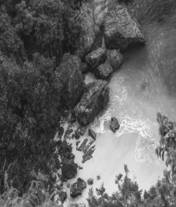
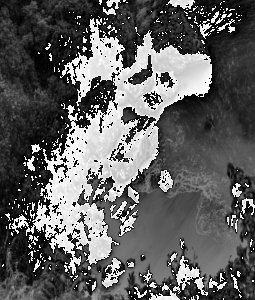

# Fast Fourier Transform: Algorithm to Compute DFT 

## Problem Statement
- Implement FFT (Fast Fourier Transform) algorithm to calculate Discrete Fourier Transform of input Image.
- [Previous assignment](../A9) implemented naive approach to calculate **DFT**.
- Text regarding this topic is in slides 25 to 29 of [DIP_FT.pdf](../A9/DIP_FT.pdf).

## Algorithm and Usage
* Read input image (shape *nxn*).
* Multiply each entry (i, j) by pow (-1, i + j ) (*0 indexing*). Doing such will eradicate the need of performing FFT shift operation at later stage.
* Firstly, 1D FFT of rows of image. Store them in variable *fft* (2D array of type struct complex).
* Transpose 2D array *fft*.
* Again do 1D FFT of rows of *fft*. Store it in variable *fft*.
* Again transpose *fft*. No need to center the low frequencies, as explained in second step.


    ```bash
    foo@bar:~$ gcc main.c -o main
    foo@bar:~$ ./main
    ```
    This code prints FFT of the image.

* Now to do the IDFT (Inverse DFT to get the image back), take conjugate of fft.
**(Need to uncomment lines 63 to 97 in main.c)**
* Do transpose, 1D FFT of rows, transpose, 1D FFT of rows and conjugate of *fft*. And we will get back same array from step 2.
* Multiply by pow(-1, i+j) to get original image back.
* **Time Complexity: O(n^2 lg(n))** (DFT/IDFT). Becasue 1D FFT of length n has *O(nlogn)* time complexity. And we are doing that, for all n rows two times each.
---
## Make it more faster
* Use implementation provided in [./FFT/Threaded](./FFT/Threaded/).
* One thing to note here is, 1D FFT of 1st row and 2nd row is independent, and this is true b.w. any pair of rows. So now we can create a thread which will do 1D FFT of one row, we can create multiple such threads to make it faster, where each thread will do FFT of different row.
* But we need to synchronize these threads before we do transpose/conjugate operations. Remember all threads are operating on different rows of *fft*(2D array) variable. So, we need to wait till all the threads have done it's work.
* It took **<2** seconds for a **1024x1024 image (DFT + IDFT)** (My laptop has i7-7500U and 16GB RAM). This is signficantly faster than *naive* method shown in [previous assignment](../A9) and matrix multiplication method shown in [A8](../A8).


## Filtering
*Now let's move to filtering part.* So when we get FFT of image, (note that *low frequencies are at center and high frequencies are at corners of our fft matrix*)
* **[Low pass:](./FFT/low_pass_filter/)** *It lets the low frequency components pass and filters out high frequency component.* Imagine a circle with radius r, centered at center of our fft matrix. Zero out entries, which are outside the circle (Chopping off high frequency components). And now do IDFT to get filtered image back.
    ```bash
    foo@bar:~$ cd FFT/low_pass_filter
    foo@bar:~$ gcc main.c -lm -lpthread -o main
    foo@bar:~$ ./main
    Give input image name : test_1024_1024.raw

    Give width and height of image : 1024 1024

    Input Image is test_1024_1024.raw. width : 1024 height : 1024 

    Enter the radius : 100


    Completed...
    test_1024_1024.raw_out is created.
    ```

    |Input Image (1024x1024) |  |
    |-|-|
    | Low-Pass Filter (r=100) |  |
* **[High pass:](./FFT/high_pass_filter/)** *It lets the high frequency components pass and filters out low frequency component.* Imagine a circle with radius r, centered at center of our fft matrix. Zero out entries, which are inside the circle (Chopping off low frequency components). And now do IDFT to get filtered image back.
    ```bash
    foo@bar:~$ cd FFT/high_pass_filter
    foo@bar:~$ gcc main.c -lm -lpthread -o main
    foo@bar:~$ ./main
    Give input image name : test_255_300.raw

    Give width and height of image : 255 300

    Input Image is test_255_300.raw. width : 255 height : 300 

    Enter the radius : 2


    Completed...
    test_255_300.raw_out is created.
    ```
    *In both of the above filters r is taken as input from user. Since most images have large coefficients for low frequency components, it doesn't make much sense to apply high pass filter on an image.*

    |Input Image (255x300) |  |
    |-|-|
    | High-Pass Filter (r=2) |  |


* **Band pass:** *Not implemented but you get the logic*. *It lets a range of frequencies pass and blocks other freqeuncies.* Imagine 2 circles with radius r1 and r2, both centered at image center of our fft matrix. Zero out entries, which are outside the ring (letting in only range of frequencies, and chopping off other frequencies). And now do IDFT to get filtered image back.


---
### Note
* Here 1D FFT that I have implemented, takes sequences which have length of integer powers of 2. Hence, image with below property is preferred.
* *width = height = 2^k, where k is positive integer*
* When above isn't true, the image is first padded such that it follows above property (*pad with zeros*). 
- And after performing IDFT, padded part is trimmed to get filtered image back.
---