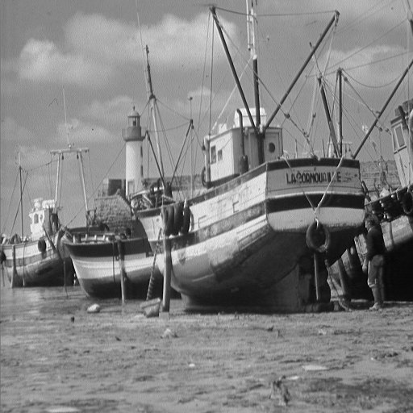
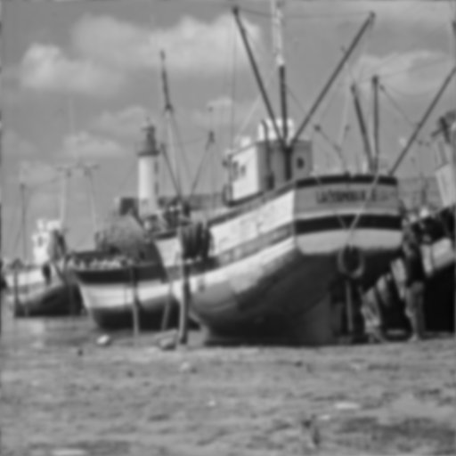

# Butterworth Low-Pass Filter

## Problem Statement
Apply Butterworth Filter on an input image.


## Usage
* After calculating DFT of image (as explained in [A10](../A10/)). Replace each entry by the equation given at slide 71 of [FreqDomFil.pdf](../A10/FreqDomFil.pdf) (Butterworth low pass filter).
* Do Inverse DFT to get filtered image back.

    ```bash
    foo@bar:~$ gcc main.c -lm -lpthread -o main
    foo@bar:~$ ./main
    Give input image name : boat_512_512.raw

    Give width and height of image : 512 512

    Input Image is boat_512_512.raw. width : 512 height : 512 

    Enter cutoff frequency : 50

    Enter order of butterworth filter : 2


    Completed...
    boat_512_512.raw_out is created.
    ```

- Cut off frequency and order of butterworth filter are taken as inputs.

- To implement high pass butterworth filter, in equation linked above, term in denominator should be inverted, meaning *D(u,v)/D_0* is be replaced by *D_0/D(u,v)*.

## Results

- Cutoff frequency: 50 & Order of butterworth filter: 2

| Input Image |  |
|-|-|
| Output Image |  | 