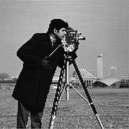

# Image Upsampling using Fourier Transform

## Problem Statement
- Upsample input image using fourier transform.

## Algorithm
- After calculating DFT (refer to [A10](../A10)) pad  transformed output with zeros (complex type) on the border, padded output should have height and width in form of powers of 2.
- Do inverse DFT of this padded transformed output to get upsampled image.

## Usage
```bash
foo@bar:~$ gcc main.c -lm -lpthread -o main
foo@bar:~$ ./main
Give input image name : cam2_128_128.raw

Give width and height of image : 128 128

Input Image is cam2_128_128.raw. width : 128 height : 128 


Enter pad amount : 10


Completed...
cam2_128_128.raw_out is created with width: 256 and height: 256
```
* Enter image details, then number of padding pixels. You can enter any postive pad amount and program will pad it such that dimensions of final padded array are nearest power of 2.
- **Note that, the upsampled image's dimensions are displayed in output and those must be used for visualization. Name of the output file doesn't indicate the image dimensions here.**

## Results

| Input Image (128x128) |  |
|-|-|
| Upsampled Image (256x256) |  | 