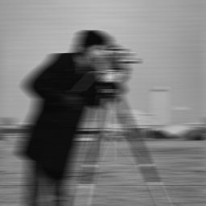
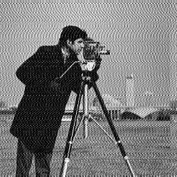

# Motion Blur Removal using Fourier Transform

## Problem Statement
- Try to recover motion blurred image using fourier transform given some prior information.


## Algorithm
* Applying motion blur on image is just convolving the image with a particular filter. Filters like sobel, robert, prewitt are convolved with image to detect edges. Similarly, to apply motion blur on image it must be convolved with a special kernel. Motion blur is common problem with smartphone cameras, it happens when one tries to capture the image of moving scene. 
* After some filter is applied on an image, how can one get the original image back. Of course, *prior information about the filter is needed*. After which, [transposed convolution/de-convolution](https://github.com/naokishibuya/deep-learning/blob/master/python/transposed_convolution.ipynb) should be performed to retrieve the image or we can utilize a **duality property of fourier transform**. Convolution of two signals is same as multiplying them in frequency domain.

## Usage
* **blurry_256_256.raw** is taken as input, which I have generated in matlab by appying a average filter of size 1x21 on cameraman image. Our filter is [1/21, 1/21, ..., 1/21], a 21 dimensional row vector.
* Take fourier transform of input image, call it *img_ft*. Then take fourier transform of average filter (zero pad the filter to to have size of input image, where actual values will be on top left), call it *filter_ft*.
* Element-wise divide *img_ft* and *filter_ft*, call it *recovered_ft*. Do **Inverse fourier transform** of *recovered_ft* to get the recovered image back. Visulize *{input image name}.raw_out*.

```bash
foo@bar:~$ gcc main.c -lm -lpthread -o main
foo@bar:~$ ./main
```

## Results

|Blurry Input Image|  |
|-|-|
|Recovered Image|  |


- **Recovered image should look same as original image, but it's not.**