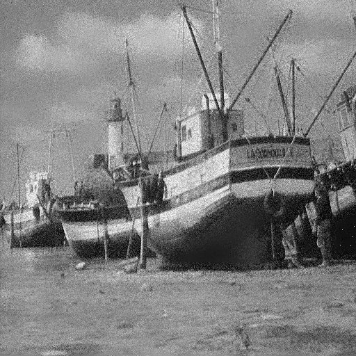

# Adaptive Filtering

## Problem Statement
Implement Adaptive Filtering to remove noise from image.

## Algorithm
* Input is noisy image and we want remove noise from this image.
* For each pixel, find mean and variance of pixels around its local neighborhood call it *mu* and *var* respectively. Size of this local neighborhood is referred as *WINDOW_SIZE* in code.
* Take a parameter *noise_var* (input parameter), called *variance of noise*. 
* Replace each entry using below equation,

    *new_value = old_value - ( ( ( noise_var / var ) x ( old_value - mu ) )*.

* *noise_var* parameter must be tuned.


## Usage
```bash
foo@bar:~$ gcc main.c -o main
foo@bar:~$ ./main
Give input image name : boat_var250_512_512.raw

Give width and height of image : 512 512

Input Image is boat_var250_512_512.raw. width : 512 height : 512 

Enter the variance of the noise : 250
boat_var250_512_512.raw_out has been generated...

Completed...
```

## Results

|Noisy Input Image|  |
|-|-|
|Filtered Image (*WINDOW_SIZE=25*)|  |