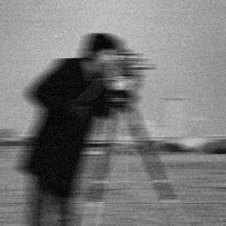
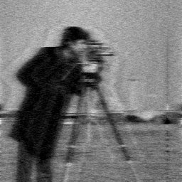

# Problem Statement
- Try to recover corrupted input image using Wiener Filtering given some prior information.

- Related method is discussed in [motion blur removal assignment](../A15), in which additive noise is assumed to be not involved. Discussed technique alleviates this assumption.

- Text regarding this topic is in [Restoration.pdf](./Restoration.pdf).

## Algorithm
* Input image (call it **g**) is degraded, it's blurry and noisy.
* The equation for Wiener filter is shown on slide 41 of *[Restoration.pdf](./Restoration.pdf)*. **K** in that equation is *noise to signal ratio* (**NSR**), which is just inverse of **SNR (Signal to Noise Ratio)**. It's taken as input. It must be tuned to recover original image.
* After applying the aforementioned equation, *Inverse Fourier Transform* is calculated to get back the recovered image back.

## Usage
```bash
foo@bar:~$ gcc main.c -lm -lpthread -o main
foo@bar:~$ ./main
Give input image name : degraded_256_256.raw

Give width and height of image : 256 256

Input Image is degraded_256_256.raw. width : 256 height : 256 

Enter noise to signal ratio : 0.052


Completed...
degraded_256_256.raw_out is created.
```

## Results

|Degraded Input Image|  |
|-|-|
| Recovered Image (NSR: 0.052) |  |