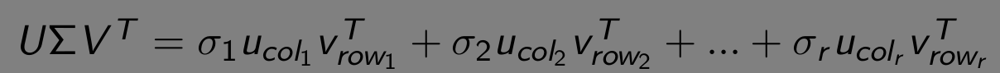
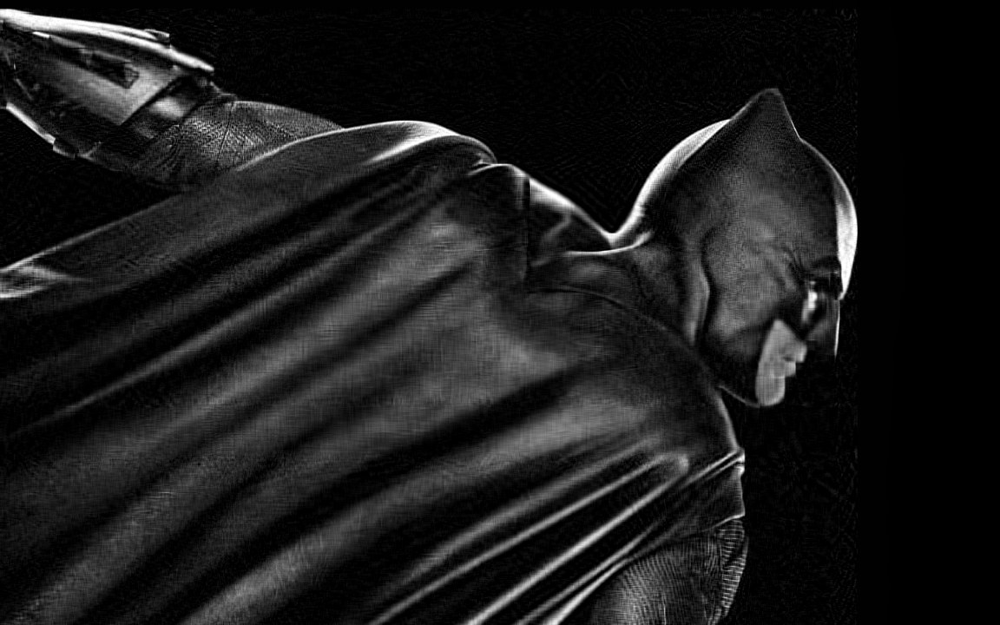

# Image Compression using Singular Value Decomposition

## Problem Statement
- Compress the grayscale image using singular value decomposition.
- Text regarding this topic is in [svd_info.pdf](./svd_info.pdf).

### Algorithm
* Read an image and store it in variable A (*mxn*).
* Find U (*mxm*), S (*mxn*) and V (*nxn*) matrices by doing SVD of A.

    

    **In summary, original matrix A can be computed from R (rank of matrix A) matrices of shape mxn, created from outer product of columns of U and columns of V. Each of those will be weighed by its corresponding  singular value.**
 - Compression can be done by considering only **k** terms where tunable parameter. When k is set to R, we can reconstruct the original image with zero error. On the other hand, good compression ratio is achieved when k \<< R.
 ### Compression Ratio
 * The columns of U, V and the corresponding singular values must be stored in memory to reconstruct the original image.
 - Matlab's svd function returns **double** (8 byte) type matrix, which I have casted to **Single** datatype, which only takes 1 byte in memory and have lower precision compared to double and float types. 
 * Compressed image is generated from total  *k x (m + n + 1)* *Single* type numbers. Original image is stored as **uint8** type, which also takes 1 byte.
 
    **Compression Ratio (CR) = number_of_pixels / (k x (m + n + 1))**

## Usage & Results
- Run [img_comp.m](./img_comp.m) in Matlab.
- [my_svd.m](./my_svd.m) contains my implementation of SVD, which is gives similar results as inbuilt svd function from Matlab. It also works fine when replaced with inbuilt function in [img_comp.m](./img_comp.m).
- As seen in the results below, as k increases the MSE decreases. Similarly, increasing k will reduce the CR.

    Input Image
    
    

| k | Mean Squared Error | CR | Reconstructed Image | 
|-|-|-|-|
| 10 | 691  | 44.3 |  |
| 25 | 371 | 17.7 |  |
| 50 | 214 | 8.9 |  |
| 75 | 155 | 5.9 |  |
| 90 | 135 | 4.9 |  |
| 100 | 124 | 4.4 |  |
| 150 | 85 | 3.0 |  |
| 200 | 60 | 2.2 |  |
| 250 | 43 | 1.8 |  |
| 300 | 30 | 1.5 |  |
| 400 | 14 | 1.1 |  |

