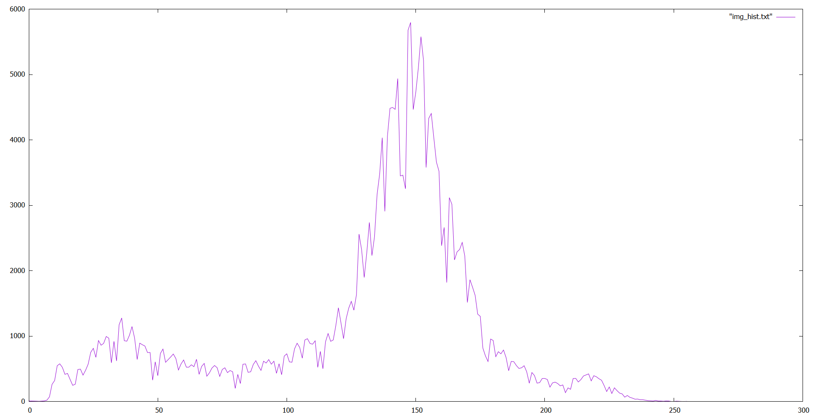

# Image Histograms

## Problem Statement
Read RAW image file and store it's histogram in .txt file

## Usage
```bash
foo@bar:~$ gcc a4.c -o a4
foo@bar:~$ ./a4
```

* Basically this program just stores the **histogram** of input image in *img_hist.txt* file. This text file can be opened in ImageJ as histogram and visulized. Also this histogram can be saved as image (.png, .jpg, etc) in ImageJ for visualization.

## Results

| **Input Image** |  |
| ----------- | --------------------- |
| **Histogram** | |
