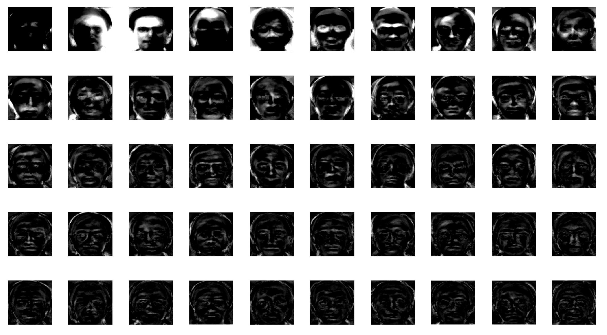
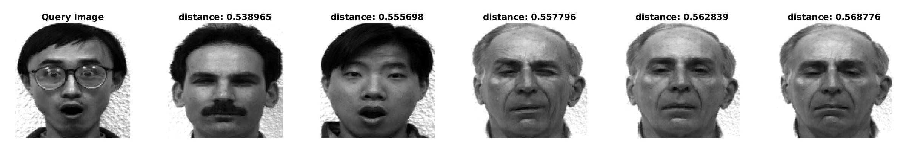
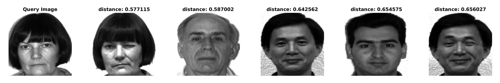

# Matching Faces using Principle Component Analysis

## Problem Statement
- Match face images of different people. Here, I have utilized Principle Component Analysis to solve this problem. Such can be used in face recognition systems.

## Dataset
- Here, I am using [yalefaces dataset](http://cvc.cs.yale.edu/cvc/projects/yalefaces/yalefaces.html). It contains 165 grayscale images in GIF format of 15 individuals. There are 11 images per subject, each showing different facial expression.

- Data is divided into non-overlapping [train](./train/) and [test](./test/) sets. Train set has 154 images and test set has 11 images.

## Algorithm

* Read all training images and make matrix **data** of shape *mxn*. Where m is total number of pixels in input image and n is total number images in training set.

- Do feature formalization on data. (subtract mean and divide by standard deviation)

- Calculate covariance matrix **C (nxn) = data.T * data**.

- Do Eigen Value Decomposition of matrix C to get **S (diagonal matrix containing Eigen values) and V (shape: nxn and its columns are Eigen vectors)** matrix. Columns of V(*nxn*) contains eigenvectors.

- Select first *k* (hyperparameter and k \< n) columns of matrix V to create our transformation matrix **T** (shape *nxk*). Apply this matrix to normalized data matrix to get eigen faces, which forms the new basis of feature space. 

- Transform training data to k dimensional space from m dimensional space using T. Transformed training features are called face embeddings. Each face image is now represented as linear combination of k eigen faces, weights being the embeddings.

- Read the test image, calculate its embeddings using T as explained previously.

* Find closest *NN* (stands for Nearest Neighbor and set to 5) face images, which are closest to query image's embeddings. Euclidean distance is used here as similarity metric.

## Usage & Results
- Run [pca.m](./pca.m) in Matlab.
- **k: 50 and NN: 5**

### Eigen Faces (Basis)

### Face Matching

| Is incorrect | Query Image |
|-|-|
|  |  |
|  |  |
|  |  |
|  |  |
|  |  |
|  |  |
|  |  |
|  |  |
|  |  |
|  |  |
|  |  |