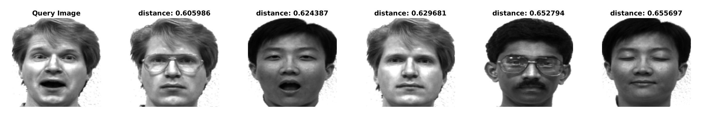
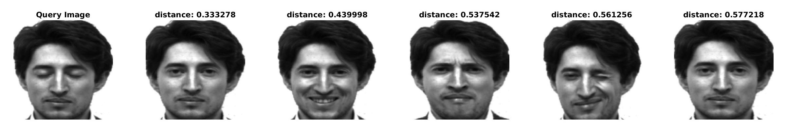
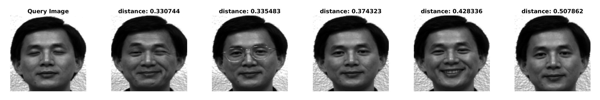
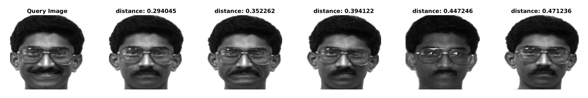

# Matching Faces using Principle Component Analysis

## Problem Statement
- Match face images of different people. Here, I have utilized Principle Component Analysis to solve this problem. Such can be used in face recognition systems.

## Dataset
- Here, I am using [yalefaces dataset](http://cvc.cs.yale.edu/cvc/projects/yalefaces/yalefaces.html). It contains 165 grayscale images in GIF format of 15 individuals. There are 11 images per subject, each showing different facial expression.

- Data is divided into non-overlapping [train](./train/) and [test](./test/) sets. Train set has 154 images and test set has 11 images.

## Algorithm

* read all training images and make matrix **data** of shape *mxn*. Where m is total number of pixels in input image and n is total number images in training set.

- Do feature formalization on data. (subtract mean and divide by standard deviation)

- Calculate covariance matrix **C (nxn) = data.T * data**.

- Do Eigen Value Decomposition of matrix C to get **S (diagonal matrix containing Eigen values) and V (shape: nxn and its columns are Eigen vectors)** matrix. Columns of V(*nxn*) contains eigenvectors.

- Select first **r** (hyperparameter and r \< n) columns of matrix V to create our transformation matrix **T** (shape *nxr*). Apply this matrix to normalized data matrix to get **Eigen faces**, which will form the new basis of feature space. 

- Transform training data to r dimensional space from m dimensional space using T. Transformed training features are called **face embeddings**. Each face image is now represented as linear combination of r eigen faces, weights being the embeddings.

- Read the test image and normalize it with respect to the training set's mean and standard deviation. Calculate its embeddings using T as explained previously.

- **K Nearest Neighbors (KNN)**: Find closest *k* face images, which are closest to query image's embeddings. Euclidean distance is used here as similarity metric.

## Usage & results
- run [pca.m](./pca.m) in Matlab.
- **r: 50 & k: 5**

### Eigen Faces (Basis)

### Face Matching (KNN)

|  | Query Image & Closest Matches |
|-|-|
| &check; |  |
| &check; |  |
| &check; |  |
| &check; |  |
| &check; |  |
| &cross; |  |
| &cross; |  |
| &check; |  |
| &check; |  |
| &cross; |  |
| &check; |  |