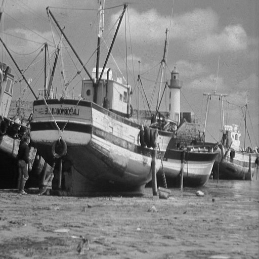
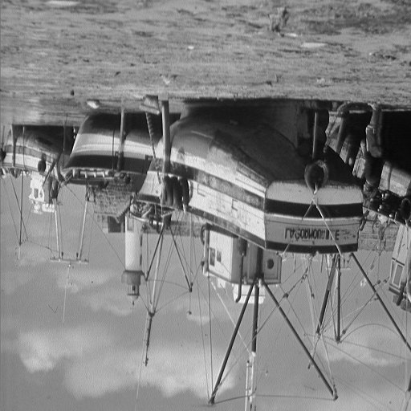

# Image Flipping

## Problem Statement
Read RAW image file and flip it horizontally/vertically.

## Usage
```bash
foo@bar:~$ gcc horizontal_reverse.c -o hr
foo@bar:~$ ./hr
Give input image name : boat_512_512.raw

Give width and height of image : 512 512

Input Image is boat_512_512.raw. width : 512 height : 512 

Output Image is boat_512_512.raw_h_out. width : 512 height : 512

foo@bar:~$ gcc vertical_reverse.c -o vr
foo@bar:~$ ./vr
Give input image name : boat_512_512.raw

Give width and height of image : 512 512

Input Image is boat_512_512.raw. width : 512 height : 512 

Output Image is boat_512_512.raw_v_out. width : 512 height : 512
```

* Enter filepath (.raw) when prompted, also enter valid width and height of the image. 
* Sample raw files are provided and its dimensions are encoded in filename at the end. 
* Horizontally flipped images have extension *raw_h_out*.
* Vertically flipped images have extension *raw_v_out*.

## Results

- Generated output RAW files are converted to JPEG and shown below using ImageJ.


| **Input Image** |  |
| ----------- | --------------------- |
| **Horizontal Flip** | |
| **Vertical Flip** | |


