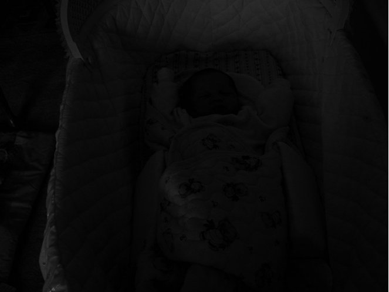
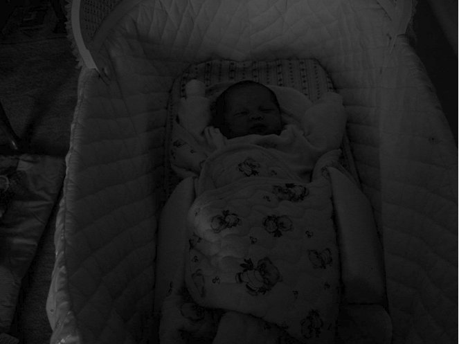

# Gamma Enhancement

## Problem Statement
Perform gamma Enhancement on input image. Good [article]((https://www.pyimagesearch.com/2015/10/05/opencv-gamma-correction/)) on this topic.

## Usage
```bash
foo@bar:~$ gcc main.c -o gamma_enh
foo@bar:~$ ./gamma_enh
```
* Gamma values greater than 1 will increase the brightness. Similarly, values lesser than 1 will reduce the brightness.
* Try different values of gamma and observe the changes in brightness.

## Results
| Input Image |  | 
|-|-|
| Output Image (gamma=1.5) |  |
