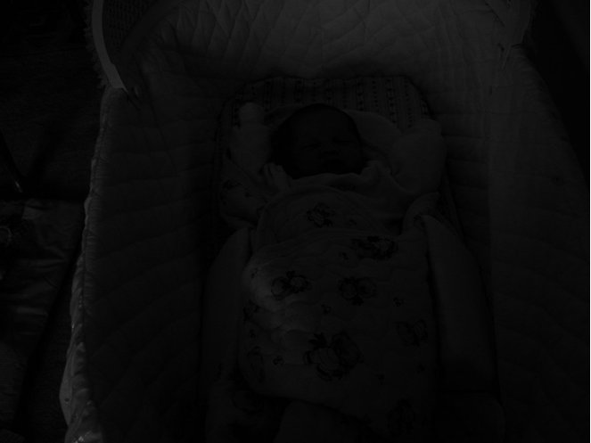
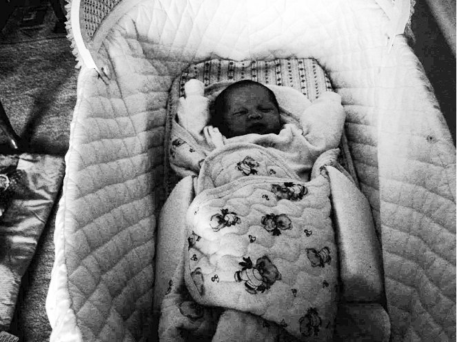
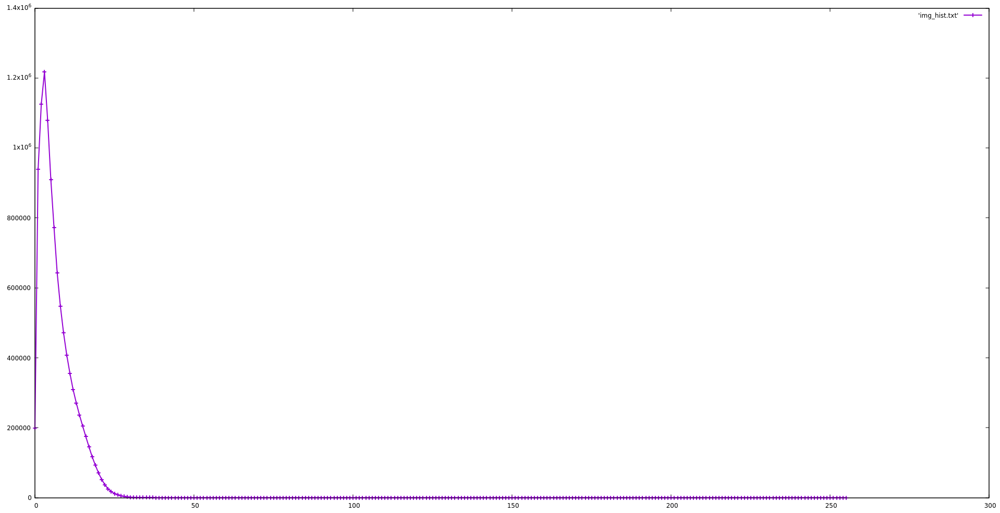
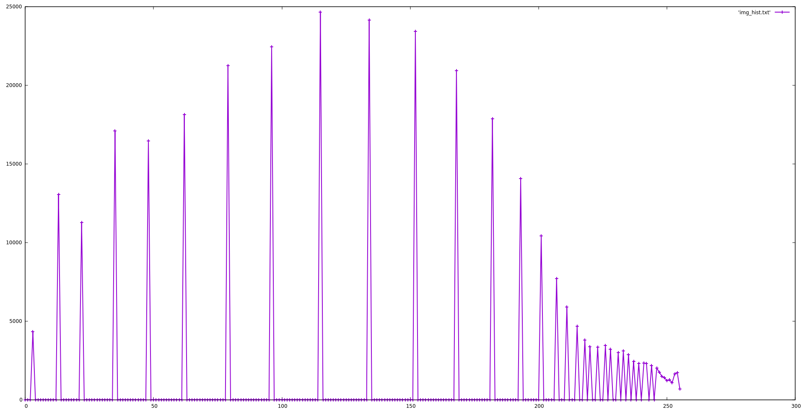

# Contrast Improvement using Histogram Equalization

## Problem Statement
* Perform histogram equalization on input image. Text regarding this topic is [**here**](./imageEnh.pdf).

* When the histogram of an image is concentrated on far left side, the image will look very dark and if it's condensed towards right side, it will look too bright. In such cases, constrast of the image can be improved by performing histogram equalization. This technique will stretch the histogram to make it more uniform across all pixel values.

## Usage
```bash
foo@bar:~$ gcc enh.c -o enh
foo@bar:~ ./enh
```
## Results

* Histograms are generated with the help of [previous assignment](../A2).

| Input | Output | 
|-------------|--------------|
|  | 
|  |  |
