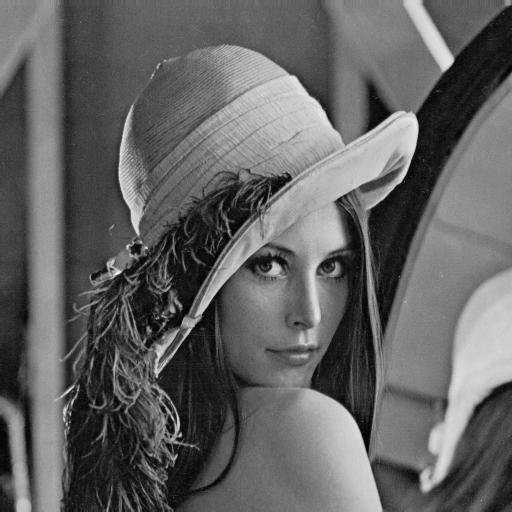
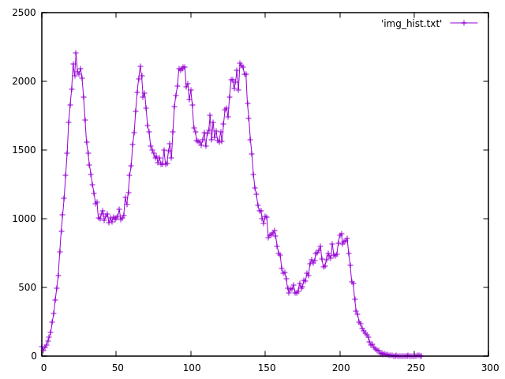
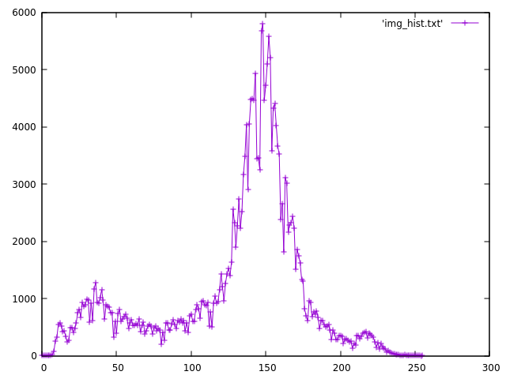
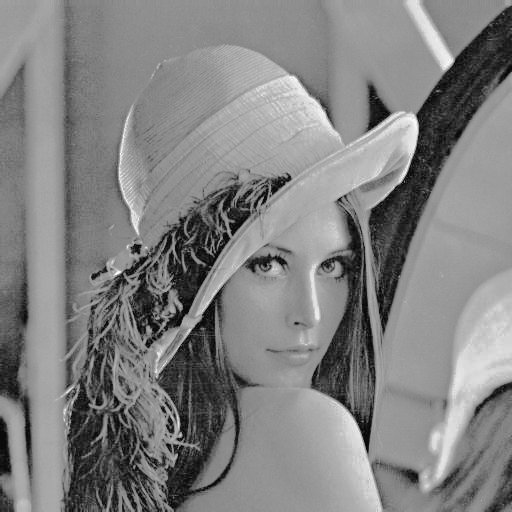
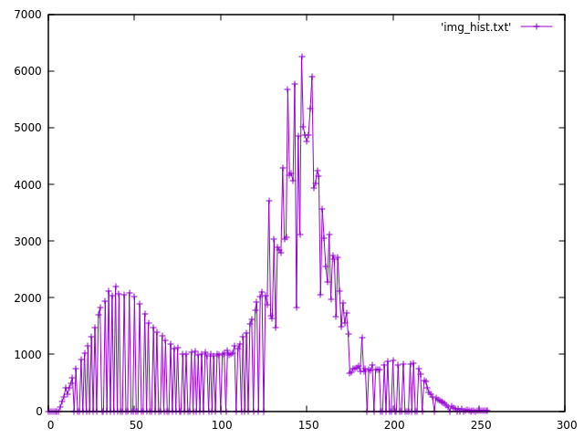

# Histogram Matching

## Problem Statement
Given an input image and a target image, transform the input image in such a way that its histogram imitates the histogram of target image without changing the content. This is the generalization of [histogram equalization](../A5) which aims to make histogram more or less **uniform**. Text regarding this topic is [**here**](./HIST_PROC.pdf).

## Usage
```bash
foo@bar:~$ gcc hist_match.c -o hist_match
foo@bar:~$ ./hist_match

Give input image name : lenna_512_512.raw

Give width and height of image : 512 512


Give target image name : boat_512_512.raw

Give width and height of image : 512 512
```
After processing output image will be stores as {input image name}.raw_out.

## Results

| Input Image |  |
| ----------- | ------------------------ |
| Input Image Histogram |  |
| Target Image |  |
| Target Image Histogram |  |
| Output Image |  |
| Output Image Histogram |  |
