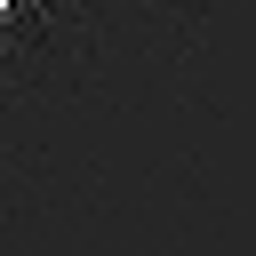
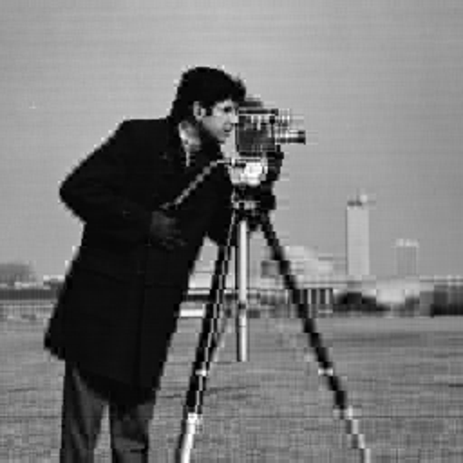
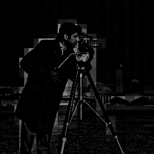

# HAAR Transform (MATLAB)

## Description
* Text regarding this topic is in slides 31 to 41 of [DIP_ImageTransforms.pdf](./DIP_ImageTransforms.pdf).
* Matlab is required to run the program.

## Usage
* There are two section in [haar.m](./haar.m).
* First section calculates HAAR transformation matrix H using HAAR function (written in [haar_func.m](./haar_func.m)). Computed H matrix is *orthonormal*.
* Transformed image **G = H x I x H'**. Where I is input image. Transformed image will be displayed when second section is ran.

## Results & Discussion

| Input Image |  |
| ----------- | -------------------- |
| Cropped Transformed Image (Top Left 32x32 box) |  |


* In transformed image, one can observe that top left corner of the image is mostly bright and as we move to bottom right corner, pixels are becoming darker. This shows that image contains mostly low frequency components (sky, clothes of the person, etc.) and very small amount of high frequency components (edges) are present in image. As we move to right and down from top left, frequncy in x direction and y direction increases respectively.

* To reconstruct the original Image
```matlab
% Updating transformed matrix and then reconstruct original image
transformed(50:end,50:end) = 0;
    
H_tran = H';
reg = H_tran*transformed*H;
subplot(1,2,1);
imshow(uint8(img));
subplot(1,2,2);
imshow(uint8(reg));
```
* Reconstructed image **I' = H' x G x H** , since H is *orthonormal*. G is transformed image.


* So where's the *filtering* part? In the above code, actually a **low pass filter** was applied by zeroing out high frequency in x and y direction. Yet, reconstructed and original image looks same until zoomed in. One can see artifacts around edges in upsampled reconstructed image.
```matlab
transformed(50:end,50:end) = 0;
```
(**transformed** in code is our transformed image **G**.)

| Reconstructed Image (low-pass) |  |
|-|-|
| Reconstructed Image Upsampled (low-pass) |  |


* Below line will apply **high pass filter** to image. Now the reconstructed image will look significantly worse than original image, even though we zero-ed out only 400 values in G.

```matlab
transformed(1:20,1:20) = 0;
```

| Input Image |  |
| ----------- | -------------------- |
| Reconstructed Image (high-pass) |  |


* Below line will apply **band pass filter** to image. 

```matlab
transformed(20:150,20:150) = 0;
```
* Similarly, if G is left unchanged, reconstructed image will exactly be same as original image.
