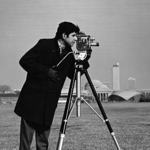

# Discrete Fourier Transform (Matlab)

## Description
- Apply Discrete Fourier Transform on an image. Text regarding this topic is in sildes 2 to 12 of [DIP_FT.pdf](./DIP_FT.pdf).
- Matlab is required to run the program.
- This exercise is similar to [HAAR transform](../A7) exercise.

## Usage
* Run [dft.m](./dft.m) in Matlab. It will show two figures, first figure corresponds to result of our approach shown above, and second is result of matlab's inbuilt function. Both looks the same, which means the implementation is correct.

## Results & Discussion
* Transformation matrix *U_nxn* or so called fourier basis matrix is created. U is unitary matrix, meaning *inverse(U) = conjugate(transpose(U))* (entris of U are complex numbers). Note, U is a square matrix.
* Transformed Image *B = U x I x U*.
    
    Input image

    

* To visulize magnitude spectrum, take absolute value of B (since entries of B are complex) and center the low frequency components.

    

    Above is center cropped 8x8 block of magnitude spectrum.

* There will be a bright dot at the center, which shows presence of low frequency components.

