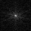

# Discrete Fourier Transform (Naive)

## Problem Statement
- Perform Discrete Fourier Transform on the input image. Text regarding this topic starts at slide 23 of [DIP_FT.pdf](./DIP_FT.pdf).

- The formulae shown in slides is used to calculate DFT of the image.
- **Time complexity: O(n^4)**

## Usage
```bash
foo@bar:~$ gcc dft.c -o dft
foo@bar:~$ ./dft

Give input image name : cam2_128_128.raw

Give width and height of image : 128 128

Input Image is cam2_128_128.raw width : 128 height : 128 


Reading input...

Creating output file...

Doing DFT...

Finding magnitude spectrum of FT...

Centering low frequency...

Completed...
```
- Magnitude spectrum of image is stored as *{input image name}.raw_out*. 

## Results

| Input Image |  |
|-|-|
| Magnitude Spectrum of FT |  |


---
### Note
* Here, I have taken image of size 64x64, reasonbeing **O(n^4)** time complexity. Also, note that *complex multiplications* are involved here.

---
